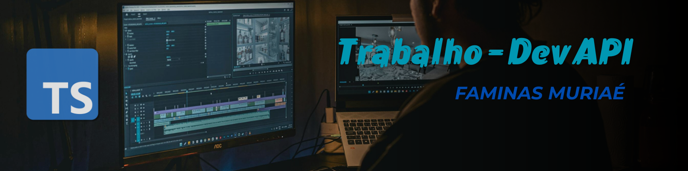

# Trabalho Dev API



## Descrição do Projeto

Este projeto implementa uma API REST seguindo o padrão **MVC (Model-View-Controller)**, organizada para facilitar a manutenção, escalabilidade e clareza do código.

A aplicação foca no desenvolvimento prático de operações básicas de um sistema **CRUD** (Criar, Ler, Atualizar, Deletar), utilizando **TypeScript**, e prezando por boas práticas como:

* Validação rigorosa dos dados de entrada.
* Tipagem forte para maior segurança e autocompletar durante o desenvolvimento.
* Controle de permissões de usuários.
* Separação clara das responsabilidades em camadas: dados, negócio, controle e rotas.

O projeto funciona com dados em memória, simulando um banco de dados, e aborda desafios reais que auxiliam a fixar conceitos essenciais para desenvolvimento de APIs modernas.

---

## Tecnologias Utilizadas

* **[Node.js](https://nodejs.org/)**: Ambiente de execução JavaScript no servidor.
* **[TypeScript](https://www.typescriptlang.org/)**: Para tipagem estática e maior robustez.
* **[Express](https://expressjs.com/)**: Framework para construção da API HTTP.
* **Git & GitHub**: Controle de versão e hospedagem do código-fonte.

---

## Estrutura do Projeto

```bash
trabalho-dev-api/
│
├─ src/                   # Código-fonte da aplicação
│ ├─ business/            # Service: regras e lógica de negócio da aplicação
│ │ ├─ postBusiness.ts    # Lógica de negócio relacionada a posts
│ │ └─ userBusiness.ts    # Lógica de negócio relacionada a usuários
│ │
│ ├─ controllers/         # Controller: lida com requisições HTTP e respostas
│ │ ├─ postController.ts  # Controladores para rotas de posts
│ │ └─ userController.ts  # Controladores para rotas de usuários
│ │
│ ├─ data/                # Repository: acesso e manipulação dos dados (simulação do DB)
│ │ ├─ postData.ts        # Funções para acessar/manipular dados dos posts
│ │ └─ userData.ts        # Funções para acessar/manipular dados dos usuários
│ │
│ ├─ img/                 # Imagem para branding e estilização do projeto
│ │ └─ IMGTDA.png         # Imagem do Repositório
│ │
│ ├─ routes/              # Routes: definição dos endpoints da API
│ │ ├─ postRoutes.ts      # Rotas relacionadas a posts
│ │ └─ userRoutes.ts      # Rotas relacionadas a usuários
│ │
│ ├─ types/               # Models: tipos e interfaces TypeScript para tipagem forte
│ │ ├─ postTypes.ts       # Tipos e interfaces para posts
│ │ └─ userTypes.ts       # Tipos e interfaces para usuários
│ │
│ ├─ app.ts               # Configura o Express, middlewares e rotas
│ ├─ db.ts                # Simulação do banco de dados (dados em memória)
│ └─ server.ts            # Entry point: inicializa o servidor Express
│
├─ .gitignore             # Arquivos e pastas ignoradas pelo Git
├─ package.json           # Gerenciador de dependências e scripts do projeto
├─ README.md              # Documentação do projeto
└─ tsconfig.json          # Configurações do compilador TypeScript
```

---

## Funcionalidades e Exercícios

### Exercício 1: Buscar usuário por ID

**Endpoint:** `GET /users/:id`

* Retorna um usuário pelo seu ID.
* Resposta 404 se não encontrado.

---

### Exercício 2: Buscar usuários por faixa etária

**Endpoint:** `GET /users/age-range?min=X&max=Y`

* Filtra usuários entre `min` e `max` anos.
* Valida os parâmetros para garantir que sejam números.

---

### Exercício 3: Criar um post

**Endpoint:** `POST /posts`

* Cria um post vinculado a um usuário existente (`authorId` no header).
* Valida título (mínimo 3 caracteres) e conteúdo (mínimo 10 caracteres).

---

### Exercício 4: Atualizar usuário (PUT)

**Endpoint:** `PUT /users/:id`

* Atualização completa dos dados do usuário.
* Campos obrigatórios: nome, email, idade, role.
* Verifica conflito de email entre usuários.

---

### Exercício 5: Atualização parcial de post (PATCH)

**Endpoint:** `PATCH /posts/:id`

* Permite atualizar apenas `title`, `content` e `published`.
* Campos `id`, `authorId` e `createdAt` não podem ser alterados.

---

### Exercício 6: Remover post

**Endpoint:** `DELETE /posts/:id`

* Só pode ser removido pelo autor ou por usuários com role `admin`.
* Verificação feita pelo header `User-Id`.

---

### Exercício 7: Remover usuários inativos

**Endpoint:** `DELETE /users/cleanup-inactive?confirm=true`

* Remove usuários que não possuem posts.
* Não remove usuários com role `admin`.
* Retorna a lista dos usuários removidos.

---

## Como Testar a API

Você pode usar clientes HTTP como Postman, Thunder Client ou Insomnia.

* Configure os endpoints conforme descrito nos exercícios acima.
* Utilize o header `User-Id` nas requisições que exigem autenticação/autorização.
* Exemplos de payload e respostas estão descritos abaixo e podem ser usados para facilitar os testes.

* [Pasta com os endpoints já configurados no Postman](https://arthursteinerr-4295979.postman.co/workspace/Arthur-Steiner's-Workspace~3abe7c33-dc8c-47a6-8e21-6f6a7a03e4fe/folder/47732566-1285ca89-1a42-47a7-aa77-f5bd79531bd7?action=share&creator=47732566&ctx=documentation)

Para executar a aplicação localmente, siga os passos abaixo:

1. **Clone o repositório:**

   ```bash
   git clone https://github.com/arthursteinerr/trabalho-dev-api.git
   cd trabalho-dev-api
   ```

2. **Instale as dependências:**

   ```bash
   npm install
   ```

3. **Inicie o servidor em modo de desenvolvimento:**

   ```bash
   npm run dev
   ```

4. **Acesse a API:**
   A aplicação estará rodando em `http://localhost:3000`.

---

## Exemplos de Requisições e Respostas

### Exercício 1: GET /users/\:id — Sucesso

```json
{
  "success": true,
  "data": {
    "id": 1,
    "name": "Arthur",
    "email": "arthur@gmail.com",
    "role": "admin",
    "age": 20
  }
}
```

### Exercício 2: GET /users/age-range?min=25\&max=35 — Sucesso

```json
{
  "success": true,
  "data": [
    {
      "id": 2,
      "name": "Thiago",
      "email": "thiago@gmail.com",
      "role": "user",
      "age": 35
    },
    {
      "id": 4,
      "name": "Flávio",
      "email": "flavio@gmail.com",
      "role": "user",
      "age": 34
    }
  ]
}
```

### Exercício 3: POST /posts — Sucesso

```json
{
  "success": true,
  "data": {
    "id": 3,
    "title": "Meu Terceiro Post",
    "content": "Conteúdo válido com mais de 10 caracteres",
    "authorId": 1,
    "createdAt": "2025-09-22T14:59:09.574Z",
    "published": false
  }
}
```

### Exercício 4: PUT /users/\:id — Sucesso

```json
{
  "success": true,
  "data": {
    "id": 1,
    "name": "Arthur Steiner",
    "email": "arthur@teste.com",
    "role": "admin",
    "age": 30
  }
}
```

### Exercício 5: PATCH /posts/\:id — Sucesso

```json
{
  "id": 1,
  "title": "Título Atualizado",
  "content": "Conteúdo válido com mais de 10 caracteres",
  "authorId": 1,
  "createdAt": "2025-09-22T14:59:09.574Z",
  "published": true
}
```

### Exercício 6: DELETE /posts/\:id — Sucesso

```json
{
  "message": "Post removido com sucesso"
}
```

### Exercício 7: DELETE /users/cleanup-inactive?confirm=true — Sucesso

```json
[
  {
    "id": 2,
    "name": "Thiago",
    "email": "thiago@gmail.com",
    "role": "user",
    "age": 35
  },
  {
    "id": 3,
    "name": "Thais",
    "email": "thais@gmail.com",
    "role": "user",
    "age": 19
  }
]
```

---

## Autor e Créditos

**Arthur Steiner**
Estudante de Análise e Desenvolvimento de Sistemas — FAMINAS Muriaé
GitHub: [@arthursteinerr](https://github.com/arthursteinerr)

---

Este projeto foi desenvolvido para a disciplina de **Desenvolvimento de APIs** da **FAMINAS**, como parte do Trabalho Acadêmico.
